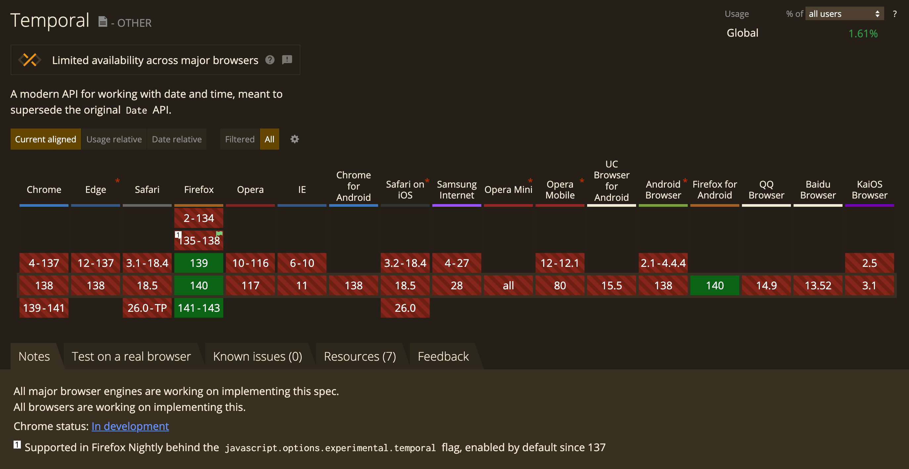

# When can I use it



[View live on caniuse.com](https://caniuse.com/mdn-javascript_builtins_temporal)

---

# Polyfill

```
https://github.com/fullcalendar/temporal-polyfill
npm install temporal-polyfill
```
